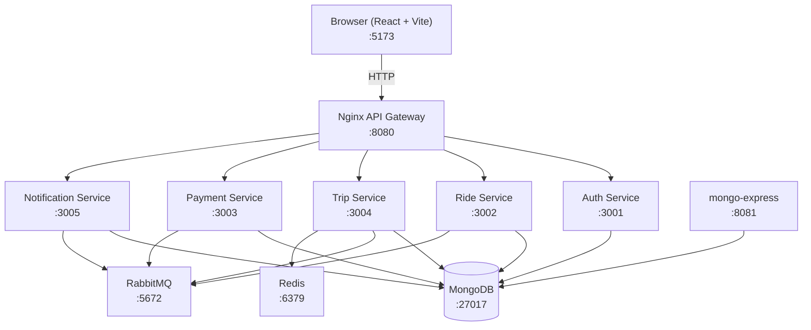
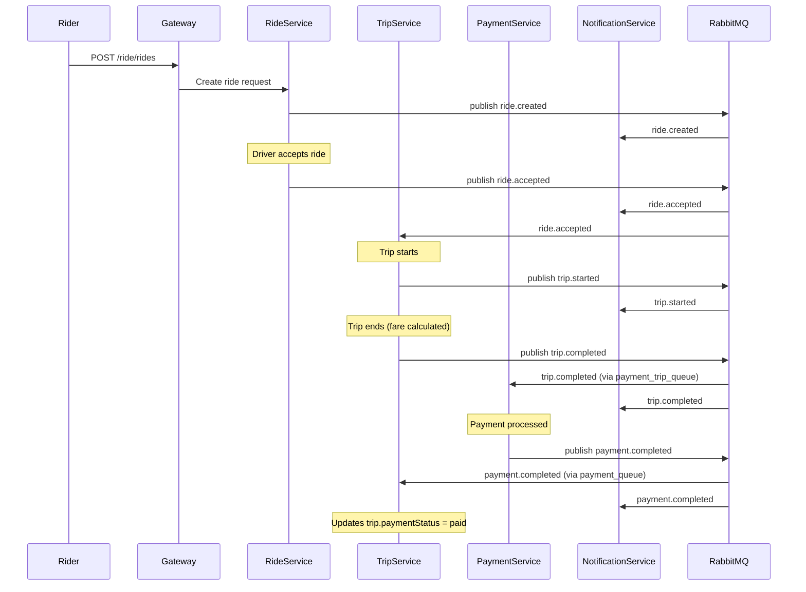
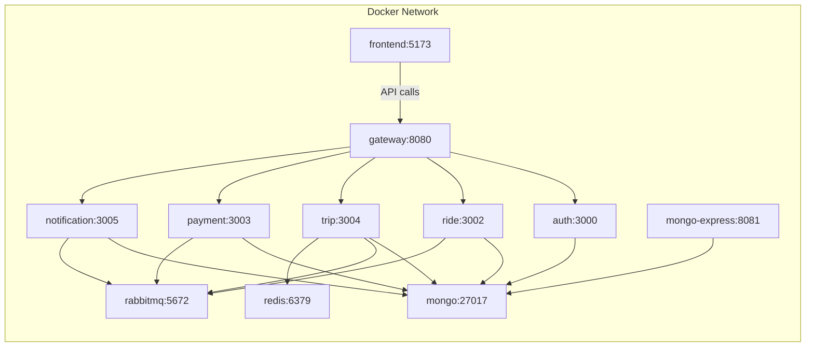

<p align="center">
  
</p>

<h1 align="center">RickshawX - Smart Mobility for CUET</h1>

<p align="center">
  <em>A microservices-based smart campus mobility platform for Chittagong University of Engineering & Technology</em>
</p>

<p align="center">
  
</p>

---

## Overview

RickshawX is a microservices-based smart mobility platform designed specifically for the CUET campus. It provides a complete ride-sharing workflow including user authentication, ride creation and acceptance, trip lifecycle management, automated fare calculation, mock payment processing, and event-driven notifications. The platform is fully containerized using Docker Compose and communicates internally via an Nginx API gateway and RabbitMQ message broker.

---

## System Architecture



---

## Tech Stack

| Category | Technology | Purpose |
|----------|-----------|---------|
| Frontend | React 18 + Vite | Single-page application |
| API Gateway | Nginx | Reverse proxy, CORS handling, path-based routing |
| Backend Services | Express.js (Node.js) | REST APIs for each microservice |
| Database | MongoDB 6 | Document store (5 separate databases) |
| Message Broker | RabbitMQ 3 (Management) | Asynchronous event-driven communication |
| Cache | Redis 7 | Optional caching (used by Trip service) |
| Containerization | Docker Compose | Multi-container orchestration |
| DB Admin | mongo-express | Web-based MongoDB visualization |

---

## Microservices

| Service | Host Port | Container Port | Database | Key Responsibilities |
|---------|-----------|----------------|----------|---------------------|
| **Auth** | 3001 | 3000 | `auth_db` | User registration, login, JWT token issuance and verification |
| **Ride** | 3002 | 3002 | `ride_db` | Ride request creation, driver acceptance, ride status management |
| **Trip** | 3004 | 3004 | `trip_db` | Trip lifecycle (start/end), fare calculation, payment status tracking |
| **Payment** | 3003 | 3003 | `payment_db` | Mock payment processing, payment record creation |
| **Notification** | 3005 | 3005 | `notification_db` | Event-driven notification storage and retrieval |

---

## API Gateway

### How It Works

The Nginx API gateway runs on port **8080** and acts as the single entry point for all API requests from the frontend. It performs:

1. **Path-based routing** - Requests are routed to the correct backend service based on the URL path prefix
2. **CORS handling** - All CORS headers are managed at the gateway level. Upstream service CORS headers are stripped via `proxy_hide_header` to prevent duplicates
3. **Header forwarding** - The `Authorization` header is forwarded to upstream services for JWT verification

### Routing Table

| Path Pattern | Upstream Service | Internal Address |
|-------------|-----------------|------------------|
| `/auth/*` | Auth Service | `http://auth:3000` |
| `/ride/*` | Ride Service | `http://ride:3002` |
| `/trip/*` | Trip Service | `http://trip:3004` |
| `/payment/*` | Payment Service | `http://payment:3003` |
| `/notification/*` | Notification Service | `http://notification:3005` |
| `/health` | Gateway itself | Returns `{"status":"ok"}` |
| `/health/{service}` | Proxied to service | Service health endpoint |

### CORS Configuration

The gateway handles all CORS:

- **Allowed Origins:** Dynamic (reflects `$http_origin`)
- **Allowed Methods:** `GET, POST, PUT, PATCH, DELETE, OPTIONS`
- **Allowed Headers:** `Authorization, Content-Type`
- **Credentials:** Enabled
- **Preflight:** OPTIONS requests return 204 with proper CORS headers

Upstream CORS headers from Express.js `cors()` middleware are stripped at the gateway to prevent duplicate headers.

---

## Database Architecture

MongoDB runs as a single instance on port **27017** with 5 separate logical databases:

| Database | Service | Collections / Purpose |
|----------|---------|----------------------|
| `auth_db` | Auth | Users (email, password hash, name, role) |
| `ride_db` | Ride | Rides (rider, driver, pickup, dropoff, status, fare) |
| `trip_db` | Trip | Trips (ride reference, status, fare calculation, payment status) |
| `payment_db` | Payment | Payments (trip reference, amount, method, status) |
| `notification_db` | Notification | Notifications (userId, type, message, event data) |

### How to Visualize the Database

#### Option 1: mongo-express (Built-in)

mongo-express is included in the Docker Compose setup and runs at:

```
http://localhost:8081
```

- **Username:** `admin`
- **Password:** `admin`

You can browse all 5 databases, view collections, inspect documents, and run queries directly in the browser.

#### Option 2: MongoDB Compass (Desktop App)

Download [MongoDB Compass](https://www.mongodb.com/products/tools/compass) and connect with:

```
mongodb://localhost:27017
```

This gives you a full GUI for exploring databases, running aggregations, and analyzing schema.

#### Option 3: MongoDB Shell (CLI)

```bash
docker exec -it rickshawx-smart_mobility_for_cuet-mongo-1 mongosh
```

Once inside the shell:

```javascript
show dbs
use auth_db
db.users.find()
use ride_db
db.rides.find()
```

---

## Event-Driven Architecture

RickshawX uses RabbitMQ for asynchronous inter-service communication. Services publish events to exchanges, and consumers receive them via bound queues.

### Exchanges and Queues

| Exchange | Routing Keys | Consumer Queues |
|----------|-------------|-----------------|
| `ride_events` | `ride.created`, `ride.accepted` | `notification_queue`, `ride_queue` |
| `trip_events` | `trip.started`, `trip.completed` | `notification_queue`, `payment_trip_queue` |
| `payment_events` | `payment.completed` | `notification_queue`, `payment_queue` |

### Complete Event Flow



---

## Quick Start

### Prerequisites

- [Docker Desktop](https://www.docker.com/products/docker-desktop/) installed and running

### Launch

```bash
docker compose up --build
```

This builds and starts all 10+ containers (MongoDB, Redis, RabbitMQ, 5 backend services, Nginx gateway, React frontend, and mongo-express).

### Access Points

| Service | URL | Description |
|---------|-----|-------------|
| Frontend | [http://localhost:5173](http://localhost:5173) | React web application |
| API Gateway | [http://localhost:8080](http://localhost:8080) | All API requests |
| mongo-express | [http://localhost:8081](http://localhost:8081) | Database browser (admin/admin) |
| RabbitMQ Management | [http://localhost:15672](http://localhost:15672) | Message broker UI (admin/admin) |

---

## Health Check and Verification

### Health Endpoints

| Endpoint | Description | Expected Response |
|----------|-------------|-------------------|
| `GET /health` | Gateway health | `{"status":"ok","service":"gateway"}` |
| `GET /health/auth` | Auth service health | `{"status":"ok","service":"auth"}` |
| `GET /health/ride` | Ride service health | `{"status":"ok","service":"ride"}` |
| `GET /health/trip` | Trip service health | `{"status":"ok","service":"trip"}` |
| `GET /health/payment` | Payment service health | `{"status":"ok","service":"payment"}` |
| `GET /health/notification` | Notification service health | `{"status":"ok","service":"notification"}` |

### Individual Health Checks

```bash
curl http://localhost:8080/health
curl http://localhost:8080/health/auth
curl http://localhost:8080/health/ride
curl http://localhost:8080/health/trip
curl http://localhost:8080/health/payment
curl http://localhost:8080/health/notification
```

### Check All Services at Once

```bash
for svc in auth ride trip payment notification; do echo "$svc: $(curl -s http://localhost:8080/health/$svc | jq -r .status)"; done
```

---

## API Reference

### Auth Service

**Register a new user:**

```bash
curl -X POST http://localhost:8080/auth/register \
  -H "Content-Type: application/json" \
  -d '{
    "name": "Rahim Ahmed",
    "email": "rahim@cuet.ac.bd",
    "password": "password123",
    "role": "rider"
  }'
```

**Login:**

```bash
curl -X POST http://localhost:8080/auth/login \
  -H "Content-Type: application/json" \
  -d '{
    "email": "rahim@cuet.ac.bd",
    "password": "password123"
  }'
```

Save the returned token:

```bash
TOKEN="<paste-token-here>"
```

### Ride Service

**Create a ride request:**

```bash
curl -X POST http://localhost:8080/ride/rides \
  -H "Content-Type: application/json" \
  -H "Authorization: Bearer $TOKEN" \
  -d '{
    "pickup": "CUET Main Gate",
    "dropoff": "Department of CSE",
    "fare": 30
  }'
```

**Accept a ride (as driver):**

```bash
curl -X PUT http://localhost:8080/ride/rides/<ride_id>/accept \
  -H "Authorization: Bearer $TOKEN"
```

### Trip Service

**Create a trip:**

```bash
curl -X POST http://localhost:8080/trip/trips \
  -H "Content-Type: application/json" \
  -H "Authorization: Bearer $TOKEN" \
  -d '{
    "rideId": "<ride_id>",
    "riderId": "<rider_id>",
    "driverId": "<driver_id>"
  }'
```

**Start a trip:**

```bash
curl -X PUT http://localhost:8080/trip/trips/<trip_id>/start \
  -H "Authorization: Bearer $TOKEN"
```

**End a trip:**

```bash
curl -X PUT http://localhost:8080/trip/trips/<trip_id>/end \
  -H "Authorization: Bearer $TOKEN" \
  -H "Content-Type: application/json" \
  -d '{"fare": 30}'
```

### Notification Service

**Get notifications for a user:**

```bash
curl http://localhost:8080/notification/notifications/<user_id> \
  -H "Authorization: Bearer $TOKEN"
```

---

## End-to-End Workflow

This demonstrates the complete ride lifecycle from registration to payment notification.

### Step 1: Register Rider and Driver

```bash
# Register rider
curl -s -X POST http://localhost:8080/auth/register \
  -H "Content-Type: application/json" \
  -d '{"name":"Rider One","email":"rider@cuet.ac.bd","password":"pass123","role":"rider"}' | jq .

# Register driver
curl -s -X POST http://localhost:8080/auth/register \
  -H "Content-Type: application/json" \
  -d '{"name":"Driver One","email":"driver@cuet.ac.bd","password":"pass123","role":"driver"}' | jq .
```

### Step 2: Login Both Users

```bash
# Login rider
RIDER_TOKEN=$(curl -s -X POST http://localhost:8080/auth/login \
  -H "Content-Type: application/json" \
  -d '{"email":"rider@cuet.ac.bd","password":"pass123"}' | jq -r .token)

# Login driver
DRIVER_TOKEN=$(curl -s -X POST http://localhost:8080/auth/login \
  -H "Content-Type: application/json" \
  -d '{"email":"driver@cuet.ac.bd","password":"pass123"}' | jq -r .token)

echo "Rider token: $RIDER_TOKEN"
echo "Driver token: $DRIVER_TOKEN"
```

### Step 3: Create a Ride Request

```bash
RIDE_RESPONSE=$(curl -s -X POST http://localhost:8080/ride/rides \
  -H "Content-Type: application/json" \
  -H "Authorization: Bearer $RIDER_TOKEN" \
  -d '{"pickup":"CUET Main Gate","dropoff":"Cafeteria","fare":25}')

RIDE_ID=$(echo $RIDE_RESPONSE | jq -r '._id // .ride._id // .id')
echo "Ride ID: $RIDE_ID"
```

### Step 4: Accept the Ride

```bash
curl -s -X PUT "http://localhost:8080/ride/rides/$RIDE_ID/accept" \
  -H "Authorization: Bearer $DRIVER_TOKEN" | jq .
```

### Step 5: Create and Start a Trip

```bash
TRIP_RESPONSE=$(curl -s -X POST http://localhost:8080/trip/trips \
  -H "Content-Type: application/json" \
  -H "Authorization: Bearer $DRIVER_TOKEN" \
  -d "{\"rideId\":\"$RIDE_ID\"}")

TRIP_ID=$(echo $TRIP_RESPONSE | jq -r '._id // .trip._id // .id')
echo "Trip ID: $TRIP_ID"

# Start the trip
curl -s -X PUT "http://localhost:8080/trip/trips/$TRIP_ID/start" \
  -H "Authorization: Bearer $DRIVER_TOKEN" | jq .
```

### Step 6: End the Trip (triggers fare calculation and payment)

```bash
curl -s -X PUT "http://localhost:8080/trip/trips/$TRIP_ID/end" \
  -H "Authorization: Bearer $DRIVER_TOKEN" \
  -H "Content-Type: application/json" \
  -d '{"fare":25}' | jq .
```

### Step 7: Verify Notifications

```bash
# Wait a moment for async event processing
sleep 2

# Get rider's notifications (replace with actual rider user ID)
curl -s "http://localhost:8080/notification/notifications/<rider_user_id>" \
  -H "Authorization: Bearer $RIDER_TOKEN" | jq .
```

At this point, the notification service should have received events for: `ride.created`, `ride.accepted`, `trip.started`, `trip.completed`, and `payment.completed`.

---

## Real-time Database Monitoring

### Using mongo-express

After running `docker compose up --build`, open [http://localhost:8081](http://localhost:8081) in your browser:

1. **Login** with credentials: `admin` / `admin`
2. **Browse databases** - You will see all 5 databases listed:
   - `auth_db` - Contains the `users` collection
   - `ride_db` - Contains the `rides` collection
   - `trip_db` - Contains the `trips` collection
   - `payment_db` - Contains the `payments` collection
   - `notification_db` - Contains the `notifications` collection
3. **Click on a database** to see its collections
4. **Click on a collection** to browse documents in real-time
5. **Run queries** using the built-in query editor

### Sample Queries via CLI

```bash
# View all users
docker exec -it rickshawx-smart_mobility_for_cuet-mongo-1 mongosh --eval "use auth_db" --eval "db.users.find().pretty()"

# View all rides
docker exec -it rickshawx-smart_mobility_for_cuet-mongo-1 mongosh --eval "use ride_db" --eval "db.rides.find().pretty()"

# View all notifications
docker exec -it rickshawx-smart_mobility_for_cuet-mongo-1 mongosh --eval "use notification_db" --eval "db.notifications.find().pretty()"
```

---

## Docker Network Topology

All containers communicate over a shared Docker Compose network. Service names act as DNS hostnames.



Internal Docker DNS resolves service names automatically. For example, the gateway reaches the auth service at `http://auth:3000` without needing IP addresses.

---

## Troubleshooting

### Network Error on Login/Register

**Symptom:** Frontend shows "Network Error" when attempting to log in or register.

**Cause:** The Nginx gateway was not sending CORS headers on OPTIONS preflight responses. The `if` block in Nginx creates a new context that does not inherit `add_header` directives from the parent `server` block.

**Fix:** CORS headers are now explicitly included inside the `if ($request_method = OPTIONS)` block, and upstream service CORS headers are stripped via `proxy_hide_header` to prevent duplicates.

**Verification:**

```bash
# Check that OPTIONS returns CORS headers
curl -v -X OPTIONS http://localhost:8080/auth/login \
  -H "Origin: http://localhost:5173" \
  -H "Access-Control-Request-Method: POST" 2>&1 | grep -i "access-control"
```

### Services Not Starting

**Symptom:** Some services exit immediately or show connection errors.

**Cause:** Backend services depend on RabbitMQ and MongoDB, which take time to initialize.

**Fix:** Check logs for the specific service:

```bash
# View logs for a specific service
docker compose logs auth
docker compose logs ride
docker compose logs trip

# Follow all logs in real-time
docker compose logs -f
```

If RabbitMQ is not ready, services will retry connections. Wait 10-15 seconds after startup.

### MongoDB Connection Issues

**Symptom:** Services cannot connect to MongoDB.

**Fix:**

```bash
# Check if MongoDB container is running
docker compose ps mongo

# Check MongoDB logs
docker compose logs mongo

# Test connectivity from inside a service container
docker exec -it rickshawx-smart_mobility_for_cuet-auth-1 sh -c "wget -qO- http://mongo:27017 || echo 'Cannot reach MongoDB'"
```

### RabbitMQ Connection Refused

**Symptom:** Services log "ECONNREFUSED" for RabbitMQ.

**Fix:** RabbitMQ takes 15-30 seconds to fully start. If the issue persists:

```bash
# Check RabbitMQ status
docker compose logs rabbitmq

# Access RabbitMQ management UI
# http://localhost:15672 (admin/admin)
```

### Containers Keep Restarting

**Fix:**

```bash
# Check which containers are unhealthy
docker compose ps

# View restart reasons
docker compose logs --tail=50 <service-name>

# Nuclear option: clean rebuild
docker compose down -v
docker compose up --build
```

---

## Project Structure

```
RickshawX-Smart_Mobility_for_CUET/
├── docker-compose.yml              # Orchestrates all services
├── package.json                    # Root package metadata
├── README.md                       # This file
│
├── frontend/                       # React + Vite frontend
│   ├── Dockerfile
│   ├── package.json
│   ├── vite.config.js
│   ├── index.html
│   ├── public/
│   │   ├── CUET_Vector_Logo.png   # University logo (favicon + navbar)
│   │   └── Cuet_gate.jpeg         # Campus banner image
│   └── src/
│       ├── main.jsx
│       ├── App.jsx                 # Main app with routing
│       ├── App.css                 # Global styles
│       ├── components/
│       │   ├── Auth/
│       │   │   ├── Login.jsx
│       │   │   └── Register.jsx
│       │   ├── Trip/
│       │   │   ├── TripCreate.jsx
│       │   │   └── TripList.jsx
│       │   ├── Notification/
│       │   │   └── NotificationList.jsx
│       │   └── ProtectedRoute.jsx
│       ├── context/
│       │   └── AuthContext.jsx
│       ├── pages/
│       │   ├── Dashboard.jsx
│       │   └── NotFound.jsx
│       └── services/
│           └── api.js              # API fetch wrapper
│
├── gateway/                        # Nginx reverse proxy
│   ├── Dockerfile
│   └── nginx.conf                  # Routing + CORS config
│
├── services/
│   ├── auth/                       # Authentication service
│   │   ├── Dockerfile
│   │   ├── package.json
│   │   └── src/
│   │       ├── server.js
│   │       ├── config/
│   │       ├── controllers/
│   │       ├── middleware/
│   │       ├── models/
│   │       └── routes/
│   │
│   ├── ride/                       # Ride management service
│   │   ├── Dockerfile
│   │   ├── package.json
│   │   └── src/
│   │       ├── server.js
│   │       ├── config/
│   │       ├── controllers/
│   │       ├── models/
│   │       └── routes/
│   │
│   ├── trip/                       # Trip lifecycle service
│   │   ├── Dockerfile
│   │   ├── package.json
│   │   └── src/
│   │       ├── server.js
│   │       ├── config/
│   │       ├── controllers/
│   │       ├── models/
│   │       └── routes/
│   │
│   ├── payment/                    # Payment processing service
│   │   ├── Dockerfile
│   │   ├── package.json
│   │   └── src/
│   │       ├── server.js
│   │       ├── config/
│   │       ├── controllers/
│   │       ├── models/
│   │       └── routes/
│   │
│   └── notification/               # Notification service
│       ├── Dockerfile
│       ├── package.json
│       └── src/
│           ├── server.js
│           ├── config/
│           ├── controllers/
│           ├── models/
│           └── routes/
│
├── scripts/
│   └── compose-up.ps1             # Windows startup script
│
└── shared/                         # Shared utilities (future)
```

---

## License

This project is developed for academic purposes at CUET (Chittagong University of Engineering & Technology).
