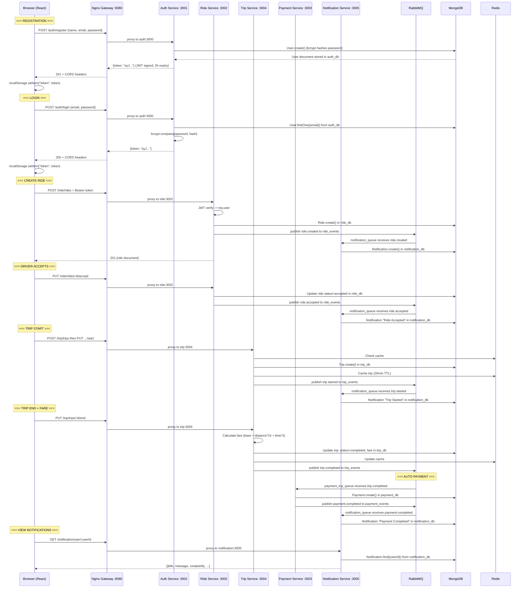
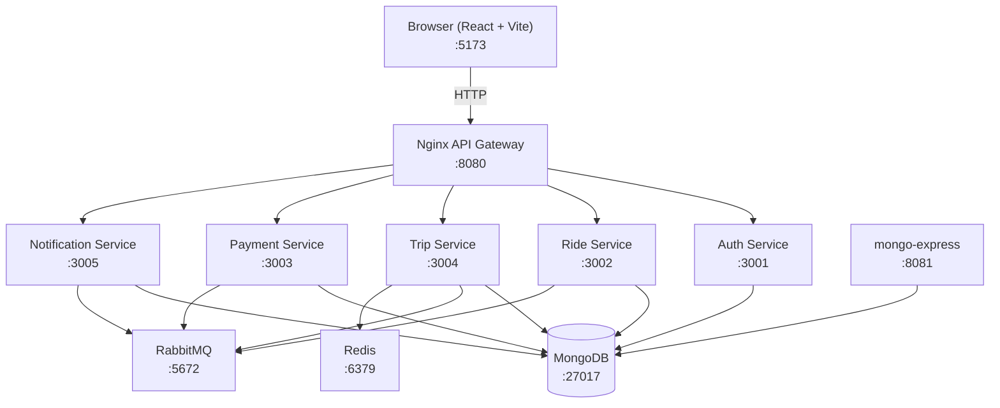
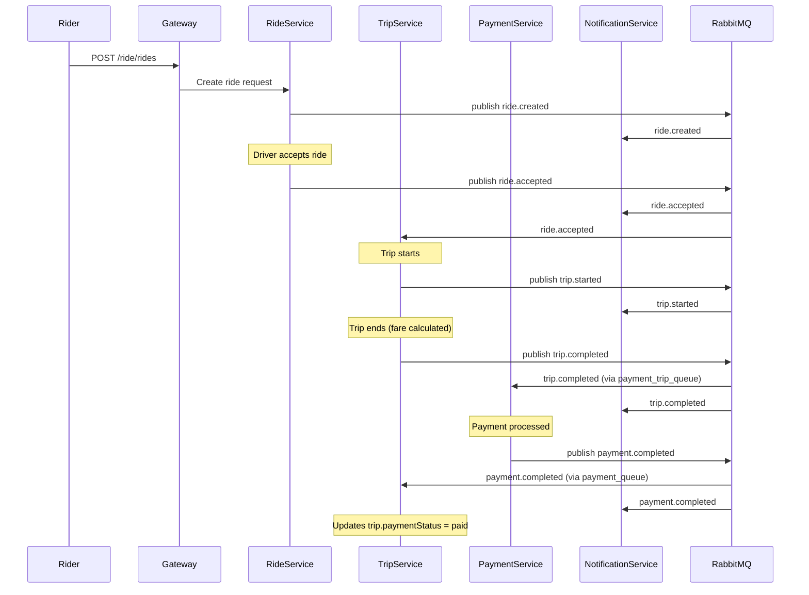
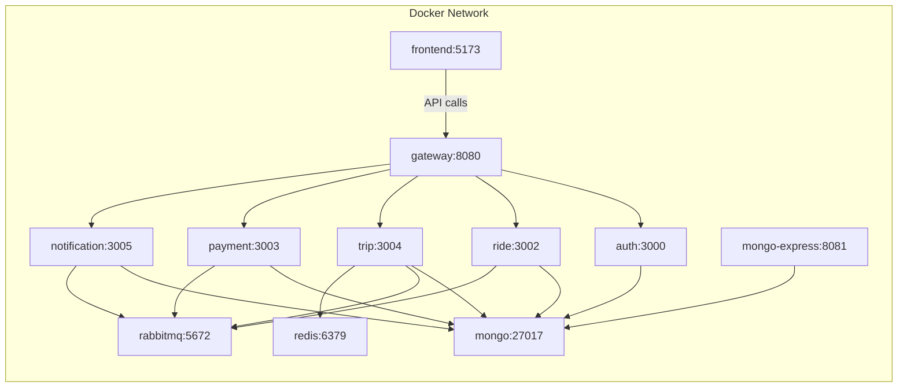

<p align="center">
  
</p>

<h1 align="center">RickshawX - Smart Mobility for CUET</h1>

<p align="center">
  <em>A microservices-based smart campus mobility platform for Chittagong University of Engineering & Technology</em>
</p>

<p align="center">
  
</p>

---

## Overview

RickshawX is a microservices-based smart mobility platform designed specifically for the CUET campus. It provides a complete ride-sharing workflow including user authentication, ride creation and acceptance, trip lifecycle management, automated fare calculation, mock payment processing, and event-driven notifications. The platform is fully containerized using Docker Compose and communicates internally via an Nginx API gateway and RabbitMQ message broker.

---

## How the System Works: Complete Request Flow

This section explains exactly what happens at every layer of the system during a complete ride lifecycle. Each step identifies WHICH component performs WHAT action and WHY.

### 1. A New User Opens the Browser and Visits the App

1. **Browser** navigates to `http://localhost:5173`
2. **Vite dev server** (or the Nginx-served production build) serves `index.html`, which loads the React bundle
3. **React** mounts `<App />` inside `<BrowserRouter>` and `<AuthProvider>`
4. **AuthContext** runs its `useEffect` hook on mount. It calls `getToken()` which reads `localStorage.getItem("token")`
5. If no token exists, the user stays unauthenticated. `isLoggedIn` remains `false`, and React Router renders the `/login` route
6. If a token is found, AuthContext calls `apiFetch("/auth/profile")` with the stored token to validate it. If the backend confirms the token is valid, the user session is restored without re-login. If the token is expired or invalid, localStorage is cleared and the user is redirected to `/login`

**Why this matters:** The frontend never blindly trusts a stored token. It always validates against the auth service on page load, ensuring stale or tampered tokens are rejected.

---

### 2. User Registration Flow

When a user fills out the registration form and clicks "Register":

**Step-by-step:**

| # | Component | Action | Why |
|---|-----------|--------|-----|
| 1 | **Browser (Register.jsx)** | Collects name, email, password from the form. Calls `apiFetch("/auth/register", { method: "POST", body: JSON.stringify({name, email, password}) })` | React component handles form state and submission |
| 2 | **apiFetch (api.js)** | Prepends `API_BASE_URL` (http://localhost:8080) to the path. Sends `fetch("http://localhost:8080/auth/register", ...)` | Centralized API wrapper ensures all requests go through the gateway |
| 3 | **Browser (HTTP layer)** | Before the POST, the browser sends an OPTIONS preflight request because the request has `Content-Type: application/json` (a non-simple header) | CORS spec requires preflight for non-simple requests |
| 4 | **Nginx Gateway (:8080)** | The `map` block validates `$http_origin` against the allowlist (localhost:5173, 5174, 8080). The `if ($request_method = OPTIONS)` block returns 204 with CORS headers (`Access-Control-Allow-Origin`, `Access-Control-Allow-Methods`, `Access-Control-Allow-Headers`, `Access-Control-Allow-Credentials`) | Gateway centralizes CORS handling so individual services do not need to manage it |
| 5 | **Browser** | Receives 204 with valid CORS headers. Proceeds to send the actual POST request | Preflight passed |
| 6 | **Nginx Gateway** | Matches `location /auth/` and proxies to `http://auth:3000`. Strips upstream CORS headers via `proxy_hide_header`. Forwards `Authorization` header and sets `X-Real-IP`, `X-Forwarded-For`, `Host` | Path-based routing directs the request to the correct microservice |
| 7 | **Auth Service (:3000)** | Express receives POST `/auth/register`. The `authController.register` function validates the body with Joi (name >= 2 chars, valid email, password >= 6 chars). If validation fails, returns 400 | Input validation prevents malformed data from reaching the database |
| 8 | **Auth Service** | Calls `User.create({ name, email, password })`. Mongoose triggers the `pre('save')` hook which hashes the password with `bcrypt.hash(password, 10)` (10 salt rounds) | Passwords are never stored in plaintext. bcrypt with 10 rounds provides adequate security for a campus app |
| 9 | **MongoDB (auth_db)** | Stores the new user document: `{ name, email, password: "$2a$10$...", _id: ObjectId }`. The `unique: true` index on email prevents duplicates (returns error code 11000 if duplicate) | MongoDB enforces uniqueness at the database level as a safety net |
| 10 | **Auth Service** | Calls `signToken(user)` which creates a JWT with payload `{ id, name, email }`, signed with `cfg.jwtSecret`, expiring in 2 hours. Returns `{ token: "eyJ..." }` with status 201 | JWT enables stateless authentication - no server-side session storage needed |
| 11 | **Nginx Gateway** | Forwards the 201 response back to the browser. Adds CORS headers. Strips any CORS headers the auth service may have added | Prevents duplicate CORS headers which would cause browser rejection |
| 12 | **Browser (Register.jsx)** | Receives the response. Extracts the token. Calls `AuthContext.register(token, fallbackUser)` | Component delegates session management to the context |
| 13 | **AuthContext** | Calls `fetchProfile(token)` to get the full user profile from `/auth/profile`. Then calls `setSession(token, userData)` which stores the token in `localStorage.setItem("token", token)`, stores user data in `localStorage.setItem("user", JSON.stringify(userData))`, sets `isLoggedIn = true`, and calls `navigate("/dashboard")` | Storing in localStorage persists the session across page refreshes. Navigating to dashboard completes the registration flow |

**What MongoDB stores after registration:**
```json
{
  "_id": "ObjectId('...')",
  "name": "Rahim Ahmed",
  "email": "rahim@cuet.ac.bd",
  "password": "$2a$10$hashedPasswordString...",
  "__v": 0
}
```

---

### 3. User Login Flow

When a returning user enters their credentials and clicks "Login":

| # | Component | Action | Why |
|---|-----------|--------|-----|
| 1 | **Browser (Login.jsx)** | Sends POST to `/auth/login` with `{ email, password }` via `apiFetch` | Same API wrapper as registration |
| 2 | **Nginx Gateway** | OPTIONS preflight (same as registration). Then proxies POST to `http://auth:3000` | Identical CORS and routing logic |
| 3 | **Auth Service** | `authController.login` calls `User.findOne({ email })` on MongoDB | Looks up user by email (indexed field) |
| 4 | **Auth Service** | If user found, calls `user.comparePassword(password)` which runs `bcrypt.compare(plaintext, hash)` | bcrypt comparison is timing-safe and handles the salt extraction automatically |
| 5 | **Auth Service** | If password matches, calls `signToken(user)` to generate a fresh JWT. Returns `{ token: "eyJ..." }` with status 200 | Fresh token on each login ensures the 2-hour expiry starts from login time |
| 6 | **Browser (Login.jsx)** | Calls `AuthContext.login(token, fallbackUser)`. AuthContext fetches profile, stores token in localStorage, sets state, navigates to `/dashboard` | Same session establishment as registration |

**If credentials are wrong:** Auth service returns `{ error: "Invalid credentials" }` with status 401. The Login component displays the error message. No token is issued or stored.

---

### 4. User Creates a Ride Request

After login, when a rider creates a new ride from the Dashboard:

| # | Component | Action | Why |
|---|-----------|--------|-----|
| 1 | **Browser (TripCreate.jsx)** | User fills in pickup and dropoff locations. Sends POST to `/ride/rides` with `{ origin, destination }` and `Authorization: Bearer <token>` header | The token proves the user is authenticated |
| 2 | **Nginx Gateway** | Matches `location /ride/`. Proxies to `http://ride:3002`. Forwards the `Authorization` header via `proxy_set_header Authorization $http_authorization` | Gateway transparently passes auth credentials to backend services |
| 3 | **Ride Service (:3002)** | Auth middleware extracts and verifies the JWT. Decodes `req.user = { id, name, email }`. Controller creates a new Ride document: `{ userId: req.user.id, origin, destination, status: "pending" }` | JWT verification ensures only authenticated users can create rides |
| 4 | **MongoDB (ride_db)** | Stores the ride document with auto-generated `rideId` (UUID format) | Each ride gets a unique identifier for tracking |
| 5 | **Ride Service** | Publishes event to RabbitMQ: `rabbitmq.publishEvent("ride_events", "ride.created", { type: "ride.created", rideId, userId, status, origin, destination, timestamp })` | Event-driven architecture decouples the ride service from downstream consumers |
| 6 | **RabbitMQ** | Routes the message through the `ride_events` topic exchange. The `notification_queue` is bound to `ride_events` with `#` (wildcard), so it receives the message | Topic exchange with wildcard binding means the notification service gets ALL ride events without the ride service knowing about it |
| 7 | **Notification Service** | Consumer on `notification_queue` receives the event. `handleEvent` calls `buildNotification(event)` which maps `ride.created` to `{ title: "Ride Requested", message: "Ride <rideId> created." }`. Creates a Notification document in MongoDB | Notifications are created asynchronously - the rider gets an immediate response without waiting for notification processing |
| 8 | **MongoDB (notification_db)** | Stores: `{ notificationId: "NOTIF_<uuid>", userId, type: "ride.created", title, message, data: <full event>, createdAt }` | Full event data is preserved for debugging and audit |
| 9 | **Ride Service** | Returns the ride document to the browser with status 201 | The rider sees confirmation immediately |

---

### 5. A Driver Accepts the Ride

| # | Component | Action | Why |
|---|-----------|--------|-----|
| 1 | **Browser** | Driver sends PUT to `/ride/rides/<rideId>/accept` with `{ driverId }` in the body and auth token in header | Driver identifies themselves for the acceptance |
| 2 | **Ride Service** | Validates driverId is present. Finds the ride by `rideId`. Checks `ride.status === "pending"` (rejects if already accepted). Updates `ride.status = "accepted"` and `ride.driverId = driverId`. Saves to MongoDB | Status check prevents double-acceptance race conditions |
| 3 | **MongoDB (ride_db)** | Updates the ride document: status changes from "pending" to "accepted", driverId is set | Persistent state change |
| 4 | **Ride Service** | Publishes `ride.accepted` event to `ride_events` exchange with routing key `ride.accepted` | Downstream services learn about the acceptance asynchronously |
| 5 | **RabbitMQ** | Routes to `notification_queue` (bound with `#` wildcard on `ride_events`) | Notification service will create an alert for the rider |
| 6 | **Notification Service** | Creates notification: `{ title: "Ride Accepted", message: "Ride <rideId> accepted by driver <driverId>." }` | Rider gets notified their ride was accepted |

---

### 6. Trip Lifecycle: Start, End, Fare Calculation, Payment, and Notification

#### 6a. Trip Creation and Start

| # | Component | Action | Why |
|---|-----------|--------|-----|
| 1 | **Trip Service** | Receives POST `/trip/trips` with `{ userId, driverId, rideId, pickupLocation, dropoffLocation }`. Checks Redis cache first (`trip:<rideId>`). If not cached, creates new Trip document with `status: "pending"` | Redis caching prevents duplicate trip creation for the same ride |
| 2 | **MongoDB (trip_db)** | Stores trip: `{ tripId: "uuid", userId, driverId, rideId, pickupLocation, dropoffLocation, status: "pending" }` | Trip is the operational record of the actual journey |
| 3 | **Trip Service** | Caches trip in Redis with 30-minute TTL. Publishes `trip.created` event | Cache speeds up subsequent lookups during the trip |
| 4 | **Trip Service** | On PUT `/trip/trips/<tripId>/start`: validates status is "pending", sets `status = "started"` and `startTime = new Date()`. Publishes `trip.started` event | startTime is recorded for fare calculation later |
| 5 | **RabbitMQ** | Routes `trip.started` to `notification_queue` | Rider and driver get notified the trip has begun |

#### 6b. Trip End and Fare Calculation

| # | Component | Action | Why |
|---|-----------|--------|-----|
| 1 | **Trip Service** | On PUT `/trip/trips/<tripId>/end`: validates status is "started". Sets `status = "completed"`, `endTime = new Date()` | Only active trips can be ended |
| 2 | **Trip Service** | Calculates duration: `(endTime - startTime) / 60000` (milliseconds to minutes). Calculates distance using Haversine formula between pickup and dropoff coordinates | Geographic distance calculation for fare basis |
| 3 | **Trip Service** | Calculates fare: `baseFare (20 BDT) + distance * 15 BDT/km + duration * 2 BDT/min`. Stores fare, duration, distance on the trip document | Transparent fare formula based on distance and time |
| 4 | **MongoDB (trip_db)** | Updates trip with: `{ status: "completed", endTime, duration, distance, fare }` | Complete trip record for billing and history |
| 5 | **Trip Service** | Publishes `trip.completed` event with `{ tripId, userId, driverId, fare, duration, distance, endTime }` to `trip_events` exchange | This single event triggers both payment and notification |

#### 6c. Automatic Payment Creation

| # | Component | Action | Why |
|---|-----------|--------|-----|
| 1 | **RabbitMQ** | Routes `trip.completed` to `payment_trip_queue` (bound to `trip_events` with `#` wildcard) AND to `notification_queue` | Payment service and notification service both react to trip completion |
| 2 | **Payment Service** | Consumer `handleTripEvent` receives the event. Checks `event.type === "trip.completed"`. Extracts `{ tripId, userId, fare }` | Only processes trip completion events |
| 3 | **Payment Service** | Checks if payment already exists for this tripId (`Payment.findOne({ tripId })`). If not, creates: `Payment.create({ tripId, userId, amount: fare, status: "completed", method: "mock" })` | Idempotency check prevents duplicate payments if the event is redelivered |
| 4 | **MongoDB (payment_db)** | Stores: `{ paymentId: "PAY_<uuid>", tripId, userId, amount, status: "completed", method: "mock", createdAt, updatedAt }` | Payment record links back to the trip |
| 5 | **Payment Service** | Publishes `payment.completed` event to `payment_events` exchange: `{ paymentId, tripId, userId, amount, status }` | Downstream services (notification, trip) learn payment succeeded |

#### 6d. Payment Notification

| # | Component | Action | Why |
|---|-----------|--------|-----|
| 1 | **RabbitMQ** | Routes `payment.completed` to `notification_queue` | Notification service creates the final alert |
| 2 | **Notification Service** | Creates notification: `{ title: "Payment Completed", message: "Payment <paymentId> confirmed for trip <tripId>." }` | Rider knows their payment was processed |
| 3 | **MongoDB (notification_db)** | Stores the notification document | Persistent notification history |

---

### 7. How Notifications Appear on the Dashboard in Real-Time

| # | Component | Action | Why |
|---|-----------|--------|-----|
| 1 | **Browser (NotificationList.jsx)** | On mount, calls `apiFetch("/notification/user/<userId>")` to fetch existing notifications | Initial load shows all past notifications |
| 2 | **NotificationList** | Listens for `window.addEventListener("rickshawx:refresh", handler)` custom events. When triggered, re-fetches notifications | Custom DOM events allow other components to trigger a refresh |
| 3 | **User clicks Refresh** | The "Refresh" button calls `fetchNotifications()` which hits the notification API again | Manual polling mechanism since the app does not use WebSockets |
| 4 | **Nginx Gateway** | Proxies GET `/notification/user/<userId>` to `http://notification:3005` | Standard gateway routing |
| 5 | **Notification Service** | Queries MongoDB: `Notification.find({ userId }).sort({ createdAt: -1 }).limit(50)` | Returns most recent 50 notifications in reverse chronological order |
| 6 | **Browser** | Receives array of notifications. React re-renders the list showing title, message, and timestamp for each | User sees all events from their ride lifecycle |

**Note:** The current implementation uses polling (manual refresh). Notifications created by RabbitMQ consumers are stored in MongoDB and fetched on the next API call. There is no WebSocket or Server-Sent Events push mechanism - the user must refresh to see new notifications.

---

### Complete Ride Lifecycle: Mermaid Data Flow Diagram



---

## Architectural Alternatives and Design Decisions

This section explores alternative architectures that were considered and explains why the current microservices approach was chosen for RickshawX.

### Alternative 1: Monolithic Architecture

**Description:** A single Node.js/Express application handling all features (auth, rides, trips, payments, notifications) in one codebase with one database.

**Pros:**
- Simpler deployment - one process, one container, one deploy command
- No network overhead between services - all function calls are in-process
- Easier debugging - single stack trace, single log stream
- Single database - no cross-service data consistency concerns
- Faster initial development - no service boundary decisions needed

**Cons:**
- Single point of failure - if the app crashes, everything is down
- Cannot scale individual components - must scale the entire application even if only auth is under load
- Tight coupling - changes to payment logic could accidentally break ride logic
- Harder to maintain as codebase grows - 5000+ line files, merge conflicts between team members
- Technology lock-in - the entire app must use the same language and framework
- Slower deployments - any change requires redeploying everything

**Why we did not choose this:** Campus mobility has uneven load patterns. During peak hours (class changes), authentication is hit heavily while payments are rarely used. Independent scaling lets us allocate resources where they are needed. Additionally, with 5 team members, a monolith creates constant merge conflicts while isolated services enable parallel development.

---

### Alternative 2: Serverless / FaaS (Functions as a Service)

**Description:** Each API endpoint deployed as an AWS Lambda or Google Cloud Function, triggered by API Gateway events, with DynamoDB or Firestore as the database.

**Pros:**
- Zero infrastructure management - no servers to maintain or patch
- Auto-scaling - handles 1 or 1000 concurrent requests automatically
- Pay-per-use pricing - no cost when no one is using the app
- Built-in monitoring and logging via cloud provider

**Cons:**
- Cold start latency - first request after idle period takes 1-3 seconds (bad for real-time ride requests)
- Vendor lock-in - migrating between cloud providers requires rewriting deployment logic
- Complex event orchestration - chaining Lambda functions is harder than RabbitMQ queues
- Harder to test locally - cloud emulators (SAM, Serverless Offline) are imperfect
- Expensive for consistent traffic - per-invocation pricing adds up with steady campus usage
- 15-minute execution limit per function - not suitable for long-running processes

**Why we did not choose this:** This is an academic project requiring local development on student laptops without cloud budgets. Docker provides consistent environments across Windows, macOS, and Linux. Local development with serverless emulators introduces friction and inaccuracy. The campus has steady usage during operating hours, making per-invocation pricing potentially expensive.

---

### Alternative 3: Service Mesh (Kubernetes + Istio/Linkerd)

**Description:** All microservices deployed in a Kubernetes cluster with a service mesh handling service-to-service communication, mutual TLS, traffic management, and observability.

**Pros:**
- Advanced traffic management - canary deployments, circuit breakers, retries
- Mutual TLS between services - encrypted internal communication without code changes
- Built-in observability - distributed tracing, metrics, and logging out of the box
- Self-healing - automatic pod restarts, rolling updates, health checks
- Horizontal pod autoscaling based on CPU/memory/custom metrics

**Cons:**
- Extreme complexity - Kubernetes alone has a steep learning curve; adding Istio doubles it
- Resource-heavy - a minimal Kubernetes cluster needs 4+ GB RAM just for the control plane
- Overkill for 5 services - the operational overhead exceeds the application complexity
- Slower development iteration - build-push-deploy cycle is slower than `docker compose up`
- Requires dedicated DevOps knowledge that a student team may not have

**Why we did not choose this:** Disproportionate complexity for a campus-scale application with 5 services. The operational overhead of maintaining a Kubernetes cluster exceeds the benefits for our use case. Docker Compose gives us service isolation, networking, and health checks without requiring a cluster. A service mesh solves problems (canary deployments, mutual TLS) that we do not have at campus scale.

---

### Alternative 4: GraphQL API Gateway

**Description:** A single GraphQL server that aggregates data from all microservices, presenting a unified schema to the frontend. Clients send queries specifying exactly what fields they need.

**Pros:**
- Clients fetch exactly what they need - no over-fetching or under-fetching
- Single endpoint - frontend makes one request instead of multiple REST calls
- Type-safe schema - GraphQL SDL provides compile-time type checking
- Built-in documentation via introspection - self-documenting API
- Subscriptions enable real-time updates (could replace our polling)

**Cons:**
- Complexity of schema stitching - merging schemas from 5 services is non-trivial
- N+1 query problems - nested resolvers can cause cascading database calls
- Harder caching - REST responses are easily cached by URL; GraphQL POST bodies are not
- Learning curve for the team - GraphQL requires learning a new query language and resolver patterns
- Overkill for simple CRUD - our operations are mostly create/read/update on single resources

**Why we did not choose this:** REST is simpler for CRUD-heavy operations, and each service has clear resource boundaries (rides, trips, payments, notifications). Our frontend makes targeted requests to specific services - there is no need to aggregate data from multiple services in a single request. The Nginx gateway already provides a single entry point, and REST endpoints map directly to our microservice boundaries.

---

## Why This Architecture is the Best Fit

The current design (Microservices + Nginx Gateway + RabbitMQ + MongoDB + Docker Compose) is the optimal choice for THIS specific use case. Here is why each architectural decision matters:

### 1. Independent Deployability

Each service can be updated, restarted, or redeployed without affecting others. If the payment service needs a bug fix, we rebuild only that container while auth, ride, trip, and notification continue running uninterrupted. In a campus environment where uptime matters during class hours, this is critical.

### 2. Domain Isolation

Auth knows nothing about trips. Payment knows nothing about rides. Each service has clear bounded contexts with its own database, models, and business logic. This means:
- A bug in fare calculation cannot corrupt user credentials
- A database schema change in notifications does not require ride service changes
- Each service can evolve its data model independently

### 3. Event-Driven Decoupling

RabbitMQ means payment does not need to call trip directly. When a trip completes, it publishes an event and moves on. The payment service picks it up from the queue when ready. If payment is down, events queue up in RabbitMQ and are processed when the service recovers. No data is lost, and the trip service is never blocked waiting for payment.

### 4. Technology Flexibility

Any service could be rewritten in a different language without affecting others. The ride service could be rewritten in Go for performance, the notification service could be rewritten in Python for ML-based prioritization. The contract is the API and the event schema, not the implementation language.

### 5. Team Scalability

Five developers can each own a service without merge conflicts. Developer A works on auth, Developer B works on rides, Developer C works on trips - all in separate directories with separate package.json files, separate Dockerfiles, and separate git histories. No stepping on each other's code.

### 6. Local Development Simplicity

Docker Compose gives everyone the same environment with one command: `docker compose up --build`. Whether you run Windows, macOS, or Linux, the services behave identically. No "it works on my machine" problems. No complex setup scripts. No version conflicts between team members' Node.js installations.

### 7. Observability

Each service has its own health endpoint (`/health`), its own logs (accessible via `docker compose logs <service>`), and its own database. When something breaks, you check one service's logs, not a 10,000-line monolith log. Problems are isolated to specific bounded contexts.

### 8. Fault Tolerance

If the notification service crashes, rides and payments still work. Events queue in RabbitMQ until the notification service recovers, then all pending notifications are processed. No user-facing functionality is lost - riders can still request and complete rides. The system degrades gracefully rather than failing catastrophically.

### 9. Campus-Appropriate Scale

This architecture is not over-engineered (no Kubernetes, no service mesh, no cloud-native complexity). It is not under-engineered (not a monolith with a single point of failure). Docker Compose is the right middle ground - it provides container isolation, networking, health checks, and multi-service orchestration without requiring a cluster, cloud account, or DevOps team.

---

### Architecture Comparison Table

| Criteria | Monolith | Microservices (Ours) | Serverless | Service Mesh |
|----------|----------|---------------------|------------|--------------|
| Development complexity | Low | Medium | Medium | High |
| Deployment | Simple | Docker Compose | Cloud-only | Kubernetes |
| Scaling granularity | All-or-nothing | Per-service | Per-function | Per-service |
| Local testing | Easy | Easy (Docker) | Hard | Very hard |
| Fault isolation | None | Per-service | Per-function | Per-service |
| Team independence | Low | High | High | High |
| Cost (academic) | Free | Free (Docker) | Cloud costs | Cluster costs |
| Event-driven support | Manual | Native (RabbitMQ) | Native (SQS/Pub/Sub) | Sidecar-based |

---

## System Architecture



---

## Tech Stack

| Category | Technology | Purpose |
|----------|-----------|---------|
| Frontend | React 18 + Vite | Single-page application |
| API Gateway | Nginx | Reverse proxy, CORS handling, path-based routing |
| Backend Services | Express.js (Node.js) | REST APIs for each microservice |
| Database | MongoDB 6 | Document store (5 separate databases) |
| Message Broker | RabbitMQ 3 (Management) | Asynchronous event-driven communication |
| Cache | Redis 7 | Optional caching (used by Trip service) |
| Containerization | Docker Compose | Multi-container orchestration |
| DB Admin | mongo-express | Web-based MongoDB visualization |

---

## Microservices

| Service | Host Port | Container Port | Database | Key Responsibilities |
|---------|-----------|----------------|----------|---------------------|
| **Auth** | 3001 | 3000 | `auth_db` | User registration, login, JWT token issuance and verification |
| **Ride** | 3002 | 3002 | `ride_db` | Ride request creation, driver acceptance, ride status management |
| **Trip** | 3004 | 3004 | `trip_db` | Trip lifecycle (start/end), fare calculation, payment status tracking |
| **Payment** | 3003 | 3003 | `payment_db` | Mock payment processing, payment record creation |
| **Notification** | 3005 | 3005 | `notification_db` | Event-driven notification storage and retrieval |

---

## API Gateway

### How It Works

The Nginx API gateway runs on port **8080** and acts as the single entry point for all API requests from the frontend. It performs:

1. **Path-based routing** - Requests are routed to the correct backend service based on the URL path prefix
2. **CORS handling** - All CORS headers are managed at the gateway level. Upstream service CORS headers are stripped via `proxy_hide_header` to prevent duplicates
3. **Header forwarding** - The `Authorization` header is forwarded to upstream services for JWT verification

### Routing Table

| Path Pattern | Upstream Service | Internal Address |
|-------------|-----------------|------------------|
| `/auth/*` | Auth Service | `http://auth:3000` |
| `/ride/*` | Ride Service | `http://ride:3002` |
| `/trip/*` | Trip Service | `http://trip:3004` |
| `/payment/*` | Payment Service | `http://payment:3003` |
| `/notification/*` | Notification Service | `http://notification:3005` |
| `/health` | Gateway itself | Returns `{"status":"ok"}` |
| `/health/{service}` | Proxied to service | Service health endpoint |

### CORS Configuration

The gateway handles all CORS:

- **Allowed Origins:** Validated against an allowlist (`localhost:5173`, `localhost:5174`, `localhost:8080`)
- **Allowed Methods:** `GET, POST, PUT, PATCH, DELETE, OPTIONS`
- **Allowed Headers:** `Authorization, Content-Type`
- **Credentials:** Enabled
- **Preflight:** OPTIONS requests return 204 with proper CORS headers

Upstream CORS headers from Express.js `cors()` middleware are stripped at the gateway to prevent duplicate headers.

---

## Database Architecture

MongoDB runs as a single instance on port **27017** with 5 separate logical databases:

| Database | Service | Collections / Purpose |
|----------|---------|----------------------|
| `auth_db` | Auth | Users (email, password hash, name, role) |
| `ride_db` | Ride | Rides (rider, driver, pickup, dropoff, status, fare) |
| `trip_db` | Trip | Trips (ride reference, status, fare calculation, payment status) |
| `payment_db` | Payment | Payments (trip reference, amount, method, status) |
| `notification_db` | Notification | Notifications (userId, type, message, event data) |

### How to Visualize the Database

#### Option 1: mongo-express (Built-in)

mongo-express is included in the Docker Compose setup and runs at:

```
http://localhost:8081
```

- **Username:** `admin`
- **Password:** `admin`

> **Note:** These default credentials are for local development only. If you deploy this stack to a shared or production environment, change the `ME_CONFIG_BASICAUTH_USERNAME` and `ME_CONFIG_BASICAUTH_PASSWORD` values in `docker-compose.yml` to strong, unique credentials.

You can browse all 5 databases, view collections, inspect documents, and run queries directly in the browser.

#### Option 2: MongoDB Compass (Desktop App)

Download [MongoDB Compass](https://www.mongodb.com/products/tools/compass) and connect with:

```
mongodb://localhost:27017
```

This gives you a full GUI for exploring databases, running aggregations, and analyzing schema.

#### Option 3: MongoDB Shell (CLI)

```bash
docker compose exec mongo mongosh
```

Once inside the shell:

```javascript
show dbs
use auth_db
db.users.find()
use ride_db
db.rides.find()
```

---

## Event-Driven Architecture

RickshawX uses RabbitMQ for asynchronous inter-service communication. Services publish events to exchanges, and consumers receive them via bound queues.

### Exchanges and Queues

| Exchange | Routing Keys | Consumer Queues |
|----------|-------------|-----------------|
| `ride_events` | `ride.created`, `ride.accepted` | `notification_queue`, `ride_queue` |
| `trip_events` | `trip.started`, `trip.completed` | `notification_queue`, `payment_trip_queue` |
| `payment_events` | `payment.completed` | `notification_queue`, `payment_queue` |

### Complete Event Flow



---

## Quick Start

### Prerequisites

- [Docker Desktop](https://www.docker.com/products/docker-desktop/) installed and running

### Launch

```bash
docker compose up --build
```

This builds and starts all 10+ containers (MongoDB, Redis, RabbitMQ, 5 backend services, Nginx gateway, React frontend, and mongo-express).

### Access Points

| Service | URL | Description |
|---------|-----|-------------|
| Frontend | [http://localhost:5173](http://localhost:5173) | React web application |
| API Gateway | [http://localhost:8080](http://localhost:8080) | All API requests |
| mongo-express | [http://localhost:8081](http://localhost:8081) | Database browser (admin/admin) |
| RabbitMQ Management | [http://localhost:15672](http://localhost:15672) | Message broker UI (admin/admin) |

---

## Health Check and Verification

### Health Endpoints

| Endpoint | Description | Expected Response |
|----------|-------------|-------------------|
| `GET /health` | Gateway health | `{"status":"ok","service":"gateway"}` |
| `GET /health/auth` | Auth service health | `{"status":"ok","service":"auth"}` |
| `GET /health/ride` | Ride service health | `{"status":"ok","service":"ride"}` |
| `GET /health/trip` | Trip service health | `{"status":"ok","service":"trip"}` |
| `GET /health/payment` | Payment service health | `{"status":"ok","service":"payment"}` |
| `GET /health/notification` | Notification service health | `{"status":"ok","service":"notification"}` |

### Individual Health Checks

```bash
curl http://localhost:8080/health
curl http://localhost:8080/health/auth
curl http://localhost:8080/health/ride
curl http://localhost:8080/health/trip
curl http://localhost:8080/health/payment
curl http://localhost:8080/health/notification
```

### Check All Services at Once

```bash
for svc in auth ride trip payment notification; do echo "$svc: $(curl -s http://localhost:8080/health/$svc | jq -r .status)"; done
```

---

## API Reference

### Auth Service

**Register a new user:**

```bash
curl -X POST http://localhost:8080/auth/register \
  -H "Content-Type: application/json" \
  -d '{
    "name": "Rahim Ahmed",
    "email": "rahim@cuet.ac.bd",
    "password": "password123",
    "role": "rider"
  }'
```

**Login:**

```bash
curl -X POST http://localhost:8080/auth/login \
  -H "Content-Type: application/json" \
  -d '{
    "email": "rahim@cuet.ac.bd",
    "password": "password123"
  }'
```

Save the returned token:

```bash
TOKEN="<paste-token-here>"
```

### Ride Service

**Create a ride request:**

```bash
curl -X POST http://localhost:8080/ride/rides \
  -H "Content-Type: application/json" \
  -H "Authorization: Bearer $TOKEN" \
  -d '{
    "pickup": "CUET Main Gate",
    "dropoff": "Department of CSE",
    "fare": 30
  }'
```

**Accept a ride (as driver):**

```bash
curl -X PUT http://localhost:8080/ride/rides/<ride_id>/accept \
  -H "Authorization: Bearer $TOKEN"
```

### Trip Service

**Create a trip:**

```bash
curl -X POST http://localhost:8080/trip/trips \
  -H "Content-Type: application/json" \
  -H "Authorization: Bearer $TOKEN" \
  -d '{
    "rideId": "<ride_id>",
    "riderId": "<rider_id>",
    "driverId": "<driver_id>"
  }'
```

**Start a trip:**

```bash
curl -X PUT http://localhost:8080/trip/trips/<trip_id>/start \
  -H "Authorization: Bearer $TOKEN"
```

**End a trip:**

```bash
curl -X PUT http://localhost:8080/trip/trips/<trip_id>/end \
  -H "Authorization: Bearer $TOKEN" \
  -H "Content-Type: application/json" \
  -d '{"fare": 30}'
```

### Notification Service

**Get notifications for a user:**

```bash
curl http://localhost:8080/notification/notifications/<user_id> \
  -H "Authorization: Bearer $TOKEN"
```

---

## End-to-End Workflow

This demonstrates the complete ride lifecycle from registration to payment notification.

### Step 1: Register Rider and Driver

```bash
# Register rider
curl -s -X POST http://localhost:8080/auth/register \
  -H "Content-Type: application/json" \
  -d '{"name":"Rider One","email":"rider@cuet.ac.bd","password":"pass123","role":"rider"}' | jq .

# Register driver
curl -s -X POST http://localhost:8080/auth/register \
  -H "Content-Type: application/json" \
  -d '{"name":"Driver One","email":"driver@cuet.ac.bd","password":"pass123","role":"driver"}' | jq .
```

### Step 2: Login Both Users

```bash
# Login rider
RIDER_TOKEN=$(curl -s -X POST http://localhost:8080/auth/login \
  -H "Content-Type: application/json" \
  -d '{"email":"rider@cuet.ac.bd","password":"pass123"}' | jq -r .token)

# Login driver
DRIVER_TOKEN=$(curl -s -X POST http://localhost:8080/auth/login \
  -H "Content-Type: application/json" \
  -d '{"email":"driver@cuet.ac.bd","password":"pass123"}' | jq -r .token)

echo "Rider token: $RIDER_TOKEN"
echo "Driver token: $DRIVER_TOKEN"
```

### Step 3: Create a Ride Request

```bash
RIDE_RESPONSE=$(curl -s -X POST http://localhost:8080/ride/rides \
  -H "Content-Type: application/json" \
  -H "Authorization: Bearer $RIDER_TOKEN" \
  -d '{"pickup":"CUET Main Gate","dropoff":"Cafeteria","fare":25}')

RIDE_ID=$(echo $RIDE_RESPONSE | jq -r '._id // .ride._id // .id')
echo "Ride ID: $RIDE_ID"
```

### Step 4: Accept the Ride

```bash
curl -s -X PUT "http://localhost:8080/ride/rides/$RIDE_ID/accept" \
  -H "Authorization: Bearer $DRIVER_TOKEN" | jq .
```

### Step 5: Create and Start a Trip

```bash
TRIP_RESPONSE=$(curl -s -X POST http://localhost:8080/trip/trips \
  -H "Content-Type: application/json" \
  -H "Authorization: Bearer $DRIVER_TOKEN" \
  -d "{\"rideId\":\"$RIDE_ID\"}")

TRIP_ID=$(echo $TRIP_RESPONSE | jq -r '._id // .trip._id // .id')
echo "Trip ID: $TRIP_ID"

# Start the trip
curl -s -X PUT "http://localhost:8080/trip/trips/$TRIP_ID/start" \
  -H "Authorization: Bearer $DRIVER_TOKEN" | jq .
```

### Step 6: End the Trip (triggers fare calculation and payment)

```bash
curl -s -X PUT "http://localhost:8080/trip/trips/$TRIP_ID/end" \
  -H "Authorization: Bearer $DRIVER_TOKEN" \
  -H "Content-Type: application/json" \
  -d '{"fare":25}' | jq .
```

### Step 7: Verify Notifications

```bash
# Wait a moment for async event processing
sleep 2

# Get rider's notifications (replace with actual rider user ID)
curl -s "http://localhost:8080/notification/notifications/<rider_user_id>" \
  -H "Authorization: Bearer $RIDER_TOKEN" | jq .
```

At this point, the notification service should have received events for: `ride.created`, `ride.accepted`, `trip.started`, `trip.completed`, and `payment.completed`.

---

## Real-time Database Monitoring

### Using mongo-express

After running `docker compose up --build`, open [http://localhost:8081](http://localhost:8081) in your browser:

1. **Login** with credentials: `admin` / `admin`
2. **Browse databases** - You will see all 5 databases listed:
   - `auth_db` - Contains the `users` collection
   - `ride_db` - Contains the `rides` collection
   - `trip_db` - Contains the `trips` collection
   - `payment_db` - Contains the `payments` collection
   - `notification_db` - Contains the `notifications` collection
3. **Click on a database** to see its collections
4. **Click on a collection** to browse documents in real-time
5. **Run queries** using the built-in query editor

### Sample Queries via CLI

```bash
# View all users
docker compose exec mongo mongosh --eval "use auth_db" --eval "db.users.find().pretty()"

# View all rides
docker compose exec mongo mongosh --eval "use ride_db" --eval "db.rides.find().pretty()"

# View all notifications
docker compose exec mongo mongosh --eval "use notification_db" --eval "db.notifications.find().pretty()"
```

---

## Docker Network Topology

All containers communicate over a shared Docker Compose network. Service names act as DNS hostnames.



Internal Docker DNS resolves service names automatically. For example, the gateway reaches the auth service at `http://auth:3000` without needing IP addresses.

---

## Troubleshooting

### Network Error on Login/Register

**Symptom:** Frontend shows "Network Error" when attempting to log in or register.

**Cause:** The Nginx gateway was not sending CORS headers on OPTIONS preflight responses. The `if` block in Nginx creates a new context that does not inherit `add_header` directives from the parent `server` block.

**Fix:** CORS headers are now explicitly included inside the `if ($request_method = OPTIONS)` block, and upstream service CORS headers are stripped via `proxy_hide_header` to prevent duplicates.

**Verification:**

```bash
# Check that OPTIONS returns CORS headers
curl -v -X OPTIONS http://localhost:8080/auth/login \
  -H "Origin: http://localhost:5173" \
  -H "Access-Control-Request-Method: POST" 2>&1 | grep -i "access-control"
```

### Services Not Starting

**Symptom:** Some services exit immediately or show connection errors.

**Cause:** Backend services depend on RabbitMQ and MongoDB, which take time to initialize.

**Fix:** Check logs for the specific service:

```bash
# View logs for a specific service
docker compose logs auth
docker compose logs ride
docker compose logs trip

# Follow all logs in real-time
docker compose logs -f
```

If RabbitMQ is not ready, services will retry connections. Wait 10-15 seconds after startup.

### MongoDB Connection Issues

**Symptom:** Services cannot connect to MongoDB.

**Fix:**

```bash
# Check if MongoDB container is running
docker compose ps mongo

# Check MongoDB logs
docker compose logs mongo

# Test connectivity from inside a service container
docker compose exec auth sh -c "wget -qO- http://mongo:27017 || echo 'Cannot reach MongoDB'"
```

### RabbitMQ Connection Refused

**Symptom:** Services log "ECONNREFUSED" for RabbitMQ.

**Fix:** RabbitMQ takes 15-30 seconds to fully start. If the issue persists:

```bash
# Check RabbitMQ status
docker compose logs rabbitmq

# Access RabbitMQ management UI
# http://localhost:15672 (admin/admin)
```

### Containers Keep Restarting

**Fix:**

```bash
# Check which containers are unhealthy
docker compose ps

# View restart reasons
docker compose logs --tail=50 <service-name>

# Nuclear option: clean rebuild
docker compose down -v
docker compose up --build
```

---

## Project Structure

```
RickshawX-Smart_Mobility_for_CUET/
├── docker-compose.yml              # Orchestrates all services
├── package.json                    # Root package metadata
├── README.md                       # This file
│
├── frontend/                       # React + Vite frontend
│   ├── Dockerfile
│   ├── package.json
│   ├── vite.config.js
│   ├── index.html
│   ├── public/
│   │   ├── CUET_Vector_Logo.png   # University logo (favicon + navbar)
│   │   └── Cuet_gate.jpeg         # Campus banner image
│   └── src/
│       ├── main.jsx
│       ├── App.jsx                 # Main app with routing
│       ├── App.css                 # Global styles
│       ├── components/
│       │   ├── Auth/
│       │   │   ├── Login.jsx
│       │   │   └── Register.jsx
│       │   ├── Trip/
│       │   │   ├── TripCreate.jsx
│       │   │   └── TripList.jsx
│       │   ├── Notification/
│       │   │   └── NotificationList.jsx
│       │   └── ProtectedRoute.jsx
│       ├── context/
│       │   └── AuthContext.jsx
│       ├── pages/
│       │   ├── Dashboard.jsx
│       │   └── NotFound.jsx
│       └── services/
│           └── api.js              # API fetch wrapper
│
├── gateway/                        # Nginx reverse proxy
│   ├── Dockerfile
│   └── nginx.conf                  # Routing + CORS config
│
├── services/
│   ├── auth/                       # Authentication service
│   │   ├── Dockerfile
│   │   ├── package.json
│   │   └── src/
│   │       ├── server.js
│   │       ├── config/
│   │       ├── controllers/
│   │       ├── middleware/
│   │       ├── models/
│   │       └── routes/
│   │
│   ├── ride/                       # Ride management service
│   │   ├── Dockerfile
│   │   ├── package.json
│   │   └── src/
│   │       ├── server.js
│   │       ├── config/
│   │       ├── controllers/
│   │       ├── models/
│   │       └── routes/
│   │
│   ├── trip/                       # Trip lifecycle service
│   │   ├── Dockerfile
│   │   ├── package.json
│   │   └── src/
│   │       ├── server.js
│   │       ├── config/
│   │       ├── controllers/
│   │       ├── models/
│   │       └── routes/
│   │
│   ├── payment/                    # Payment processing service
│   │   ├── Dockerfile
│   │   ├── package.json
│   │   └── src/
│   │       ├── server.js
│   │       ├── config/
│   │       ├── controllers/
│   │       ├── models/
│   │       └── routes/
│   │
│   └── notification/               # Notification service
│       ├── Dockerfile
│       ├── package.json
│       └── src/
│           ├── server.js
│           ├── config/
│           ├── controllers/
│           ├── models/
│           └── routes/
│
├── scripts/
│   └── compose-up.ps1             # Windows startup script
│
└── shared/                         # Shared utilities (future)
```

---

## License

This project is developed for academic purposes at CUET (Chittagong University of Engineering & Technology).
